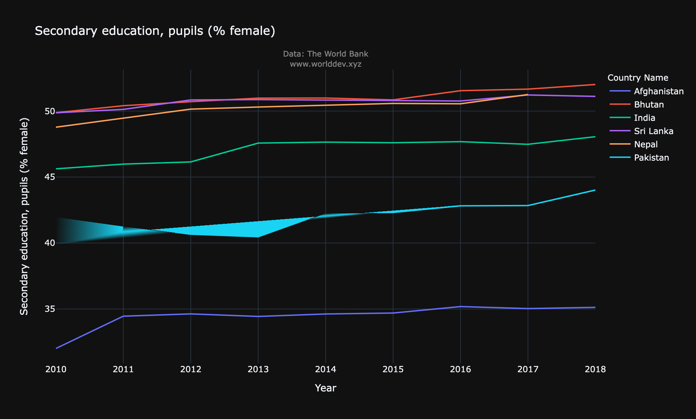
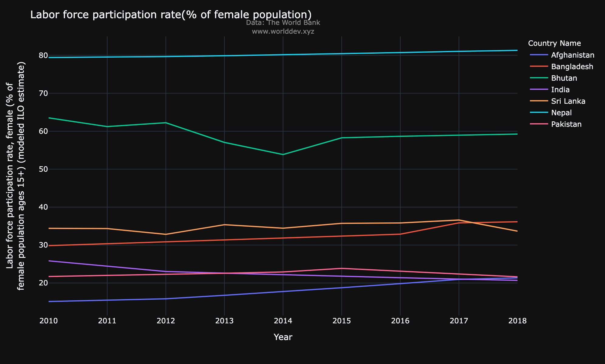

# Does education have an effect on the participation of women in the workforce?
*Name* : *Ajit Jadhav*

*University of Maryland, Baltimore County*

## Introduction: 

Participation of women in workforce across the globe has been on the downturn for quite some time now. It may come as a surprise when we take a broad view of the subject because on the outside it seems as the world is developing very rapidly with tech-giants taking over our everyday lives, mordernization in cultures around the world, eradication of backward or gender discriminating practices, greater acceptance or  etc. but when we delve deeper we come to know that there are lesser percentage of women in the work-force than there were in the 1990's. Quite shocking right? So let's dig a little deeper and have a look at what has been the trend of women in the labor-force across the globe and which countries have the highest participation of women population in the workforce.

## Topics & Indicators:
**Female Labor force participation rate(% of female population ages 15+):** It is the proportion of the population ages 15 and older that is economically active: all people who supply labor for the production of goods and services during a specified period.

**Secondary education, pupils (% female):** This represents the percentage of female pupils out of the total pupils enrolled in secondary level education in public and private schools.

## Countries under observation:
Following are the South Asian countries under consideration:
- India
- Pakistan
- Bangladesh
- Sri-Lanka
- Bhutan
- Nepal

## How is enrollment in higher level education related to participation in labor force?

First we'll have a look at both enrollment of women in higher level education and participation of women in the labor force individually and then we'll look at a comparison between the two.

### Percentage of women enrolled in higher level education:

Following are some observations from the above graph:
- We can see that Bangladesh leads the way consistantly over the years with the highest percentage of female pupils enrolled in secondary level education.
- Bhutan, Sri Lanka and Nepal follow Bhutan with enrollment around 48%-51% of the total pupils over the years.
- India and Pakistan are fifth and sixth followed by Afganistan in the list with all three countries showing an approximate increase of 3-4% in enrollment over the span of 8 years.

### Percentage of women in labor-force:

Following are some observations from the above graph:
- What is quite clear is that Nepal stands out from all the other countries with female labor-force participation of close to 80%.
- Bhutan, Sri Lanka and Bangladesh follow Nepal in labor-force participation by women.
- Similarly Pakistan, India and Afganistan are at the bottom.
- We can observe that the countries follow a somewhat similar trend in both 'percentage of women enrolled in senior-level education' and 'percentage of women in labor-force'. Let's take a closer look at this similarity with a scatter plot to further strengthen inference.

### Comparison of 'Percentage of women enrolled in higher-level education' vs 'Percentage of women in labor-force':

Following are some observations from the above scatterplot:
- The above scatter plot
