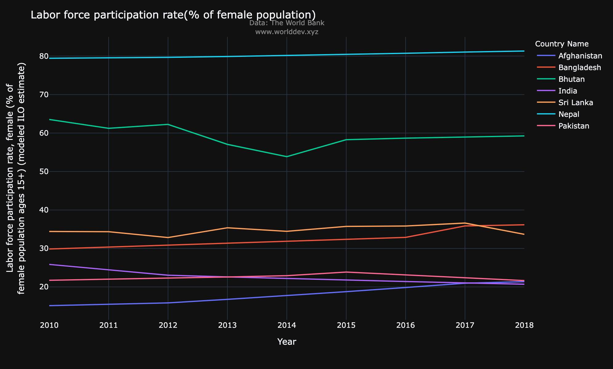
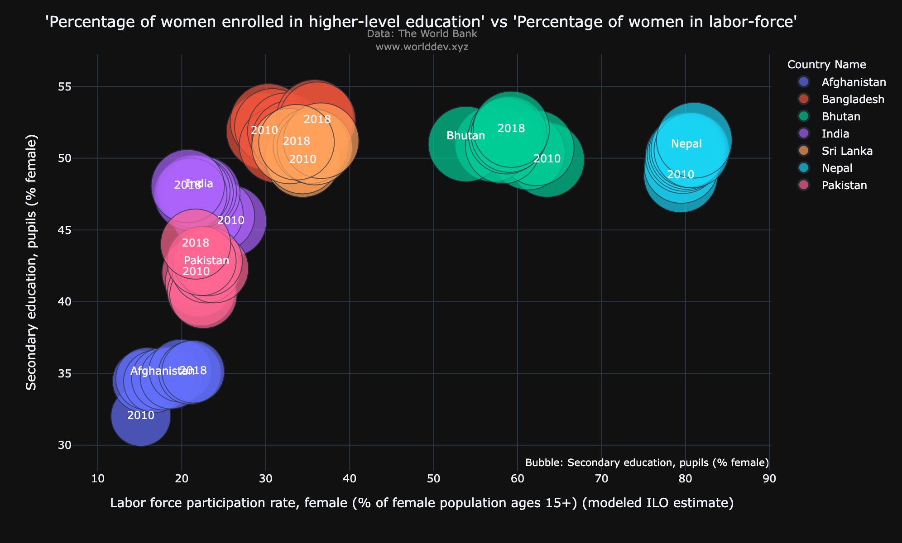
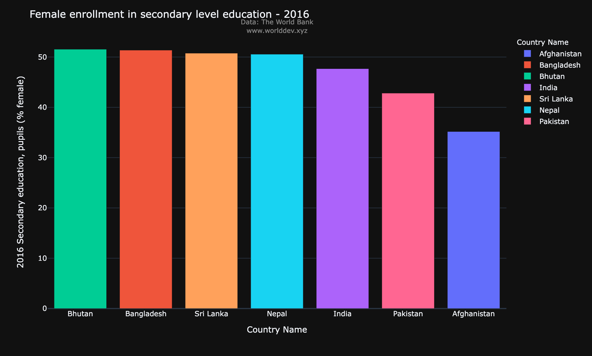
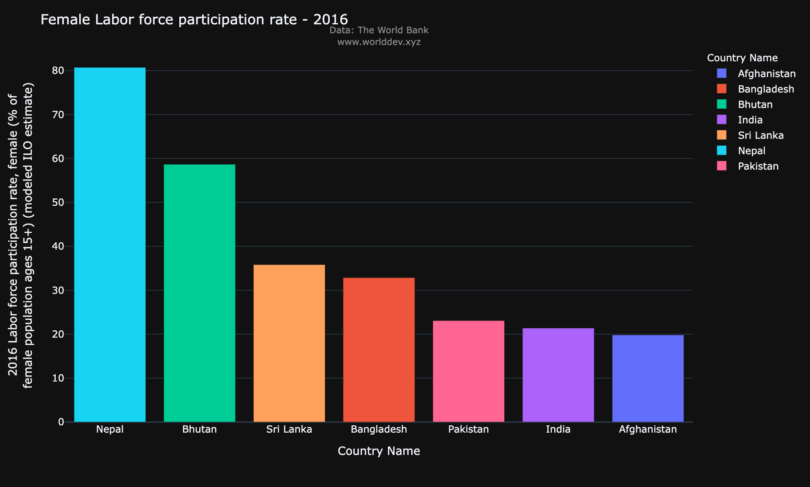

# Does education have an effect on the participation of women in workforce?
*Name* : *Ajit Jadhav*

*University of Maryland, Baltimore County*

## Introduction: 

Participation of women in workforce across the globe has been on the downturn for quite some time now. It may come as a surprise when we take a broad view of the subject because on the outside it seems as the world is developing very rapidly with tech-giants taking over our everyday lives, mordernization in cultures around the world, eradication of backward or gender discriminating practices etc. but when we delve deeper we come to know that there are lesser percentage of women in the work-force than there were in the 1990's. Quite shocking right? So let's dig a little deeper and have a look at at what kind of an impact does 'enrollment in higher-level education' have on participation of women population in the workforce.

## Topics & Indicators:
**Female Labor force participation rate(% of female population ages 15+):** It is the proportion of the population ages 15 and older that is economically active: all people who supply labor for the production of goods and services during a specified period.

**Secondary education, pupils (% female):** This represents the percentage of female pupils out of the total pupils enrolled in secondary level education in public and private schools.

## Countries under observation:
Following are the South Asian countries under consideration:
- India
- Pakistan
- Bangladesh
- Sri-Lanka
- Bhutan
- Nepal
- Afganistan

## How is enrollment in higher level education related to participation in labor force?

First we'll have a look at both enrollment of women in higher level education and participation of women in the labor force individually and then we'll look at a comparison between the two.

### Percentage of women enrolled in higher level education:

Following are some observations from the above graph:
- We can see that Bangladesh leads the way consistently over the years with the highest percentage of female pupils enrolled in secondary level education.
- Bhutan, Sri Lanka and Nepal follow Bhutan with enrollment around 48%-51% of the total pupils over the years.
- India and Pakistan are fifth and sixth followed by Afganistan in the list with all three countries showing an approximate increase of 3-4% in enrollment over the span of 8 years.

### Percentage of women in labor-force:

Following are some observations from the above graph:
- What is quite clear is that Nepal stands out from all the other countries with female labor-force participation of close to 80%.
- Bhutan, Sri Lanka and Bangladesh follow Nepal in labor-force participation by women.
- Similarly Pakistan, India and Afganistan are at the bottom.
- We can observe that the countries follow a somewhat similar trend in both 'percentage of women enrolled in senior-level education' and 'percentage of women in labor-force'. Let's take a closer look at this similarity with a scatter plot to further strengthen inference.

### Comparison of 'Percentage of women enrolled in higher-level education' vs 'Percentage of women in labor-force':

Following are some observations from the above scatterplot:
- From the above scatter plot we can see that higher the number of women enrolled in secondary-level education higher is the percentage of women in the workforce
- Hence, we can see that the inference that we had drawn from the above two graphs is further consolidated by the scatter-plot.
- Nepal, Bhutan, Sri Lanka and Bangladesh are followed by India, Pakistan and Afganistan in the scatterplot and we can see that this follows the same trend as seen in the above two graphs.

### Comparing the two factors for the year 2016:
- From the above scatterplot we have seen that countries with higher enrollment in senior-level education have a higher percentage of women in the work froce. Now in this section we'll try to see if the same pattern is being followed within the year 2015:

From the above two bar graphs we can verify that a somehwat similar trend is followed in both, 'female enrollment in secondary education' and 'female participation in labor-force'

### Conclusion:
- From the above observations we can conclude that enrollment in higher education does have an impact on percentage of women engaged in the workforce.
- It is not the sole factor that affects employment of women, but it is one of the many factors.
- The decrease in women’s participation in the labor force is a critical concern of today's. From what we have seen in here indicates that encouraging women to pursue higher education can have a positive impact on the number of women in the work-force. Higher number of women in the workforce not only helps in reducing the gender disparity but also helps in speeding up the economic development of the country.
- However, the relationship between enrollment in higher education and participation in work-force is far from straightforward.  Ultimately, women’s employment is driven by a range of other multifaceted factors such as fertility rates, social norms, and the nature of job creation.
